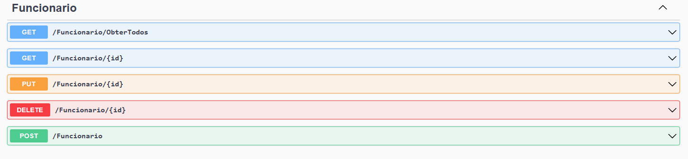
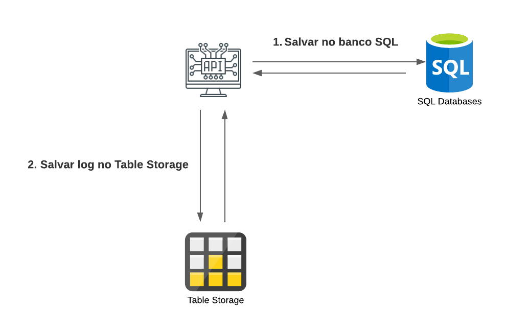

# DIO - Trilha .NET - Nuvem com Microsoft Azure
www.dio.me

## Desafio de projeto
Desafio realizado com os conhecimentos adquiridos no módulo de Nuvem com Microsoft Azure, da trilha .NET da DIO.

## Contexto
Sistema de RH: com a versão inicial do sistema, o usuário poderá cadastrar os funcionários de uma empresa.

O cadastro é um CRUD, ou seja, permite obter os registros, criar, salvar e deletar esses registros. É armazenada em logs, toda e qualquer alteração que venha a ocorrer com um funcionário.

## Premissas
- Web API
- Implantada no Microsoft Azure, utilizando o App Service para a API
- SQL Database para o banco relacional e;
- Azure Table para armazenar os logs.

Classe principal, a classe Funcionario e a FuncionarioLog:


A classe FuncionarioLog é filha da classe Funcionario, pois o log terá as mesmas informações da Funcionario.

## Métodos esperados

**Swagger**



**Endpoints**


| Verbo  | Endpoint                | Parâmetro | Body               |
|--------|-------------------------|-----------|--------------------|
| GET    | /Funcionario/ObterTodos | N/A       | N/A                |
| GET    | /Funcionario/{id}       | id        | N/A                |
| PUT    | /Funcionario/{id}       | id        | Schema Funcionario |
| DELETE | /Funcionario/{id}       | id        | N/A                |
| POST   | /Funcionario            | N/A       | Schema Funcionario |

Esse é o schema (model) de Funcionario, utilizado para passar para os métodos que exigirem:

```json
{
  "nome": "Nome funcionario",
  "endereco": "Rua 1234",
  "ramal": "1234",
  "emailProfissional": "email@email.com",
  "departamento": "TI",
  "salario": 1000,
  "dataAdmissao": "2022-06-23T02:58:36.345Z"
}
```

## Ambiente
Diagrama do ambiente montado no Microsoft Azure, utilizando o App Service para a API, SQL Database para o banco relacional e Azure Table para armazenar os logs.



